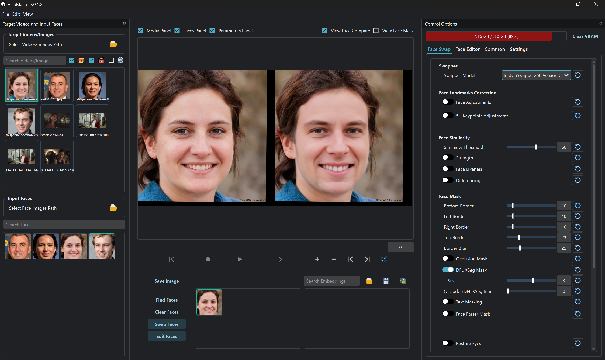

# VisoMaster

AI face-swap and face-editing for images, videos, webcam, and WebRTC streams. GPU-accelerated ONNX/TensorRT models, real-time preview, three UI modes.



---

## UI Modes

| Mode | Windows | Linux / macOS | Description |
|------|---------|---------------|-------------|
| **Qt** | `Start.bat qt` | `bash scripts/launch.sh --mode qt` | Native Qt desktop app |
| **WebView** | `Start.bat webview` | `bash scripts/launch.sh --mode webview` | Qt window with embedded React UI |
| **Web** | `Start.bat web` | `bash scripts/launch.sh --mode web` | Headless API + React in browser |

All three modes share the same Python inference backend and FastAPI server.

---

## Features

- **Face Swap** — Inswapper, InStyleSwapper, SimSwap, GhostFace, CSCS, DeepFaceLab DFM
- **Face Editor** — LivePortrait expression/pose control, RGB makeup adjustments
- **Face Restoration** — GFPGAN, CodeFormer, GPEN, VQFR, RestoreFormer
- **Frame Enhancement** — RealESRGAN, BSRGAN, DDColor, DeOldify
- **Masking** — Occluder, DFL XSeg, FaceParser, CLIPSeg, per-part mouth/eye restore
- **Live Playback** — real-time preview before saving
- **Virtual Camera** — output to OBS, Zoom, Twitch via pyvirtualcam
- **WebRTC Streaming** — WHIP protocol ingestion from phones/OBS
- **Video Markers** — per-frame parameter overrides
- **TensorRT** — auto-built engine cache for maximum GPU throughput

---

## Installation

### Prerequisites

| Tool | Purpose | Link |
|------|---------|------|
| Git | Clone repo + submodules | [git-scm.com](https://git-scm.com/downloads) |
| Miniconda | Python environment | [anaconda.com](https://www.anaconda.com/download) |
| Bun | Frontend dependencies | [bun.sh](https://bun.sh) |
| NVIDIA GPU | CUDA 12.4 or 11.8 | — |

### 1 — Clone with submodules

```bash
git clone --recurse-submodules https://github.com/visomaster/VisoMaster.git
cd VisoMaster
```

Already cloned without submodules?

```bash
git submodule update --init --recursive
```

### 2 — Create the Python environment

```bash
conda create -n visomaster python=3.10.13 -y
conda activate visomaster
conda install -c nvidia/label/cuda-12.4.1 cuda-runtime
conda install -c conda-forge cudnn
```

### 3 — Install dependencies and download models

**Linux / macOS / Git Bash:**

```bash
bash scripts/install.sh              # CUDA 12.4, default models
bash scripts/install.sh --cuda 118   # CUDA 11.8
bash scripts/install.sh --full       # all models (~8 GB)
```

**Windows (manual steps):**

```bat
conda activate visomaster
pip install -r requirements_cu124.txt
cd visomaster-ui && bun install && cd ..
python download_models.py
```

### 4 — Configure environment

```bash
cp .env.example .env   # Linux/macOS
copy .env.example .env  # Windows
```

Edit `.env` and add a `TAILSCALE_AUTHKEY` if you need WebRTC on a cloud/RunPod instance.

### 5 — Windows portable dependencies

For the portable build (no conda), download the dependency archive from [visomaster-assets releases](https://github.com/visomaster/visomaster-assets/releases/tag/v0.1.0_dp) and extract it into `dependencies/`.

---

## Launching

### Windows

Double-click `Start.bat` (or run it from a terminal). It detects whether you have the portable bundled Python or a conda environment, then shows a menu:

```
  1. Qt Desktop         (native Qt UI)
  2. WebView            (Qt + embedded web UI)
  3. Web                (API server + browser UI)
```

Select a number and press Enter.

### Linux / macOS

```bash
bash scripts/launch.sh                   # Qt (default)
bash scripts/launch.sh --mode qt
bash scripts/launch.sh --mode webview
bash scripts/launch.sh --mode web
```

### WebView mode — Vite dev server required

WebView embeds the React app from the Vite dev server. Start it first in a separate terminal:

```bash
cd visomaster-ui && bun run dev
```

Then launch:

```bat
Start.bat   :: Windows — select option 2
```
```bash
bash scripts/launch.sh --mode webview   # Linux/macOS
```

Pass extra flags to `web_main.py` by editing `Start.bat` or running directly:

```bat
python web_main.py --skip-workspace
python web_main.py --auto-last-workspace
python web_main.py --workspace path\to\workspace.json
```

### Web mode

Starts the FastAPI server and Vite dev server together. On Windows they open in separate minimised console windows; close them to stop. On Linux/macOS Ctrl+C stops both.

---

## Updating (portable build)

```bat
Update_Portable.bat
```

Pulls `origin/main`, updates submodules, reinstalls Python deps, and re-downloads any new models. Reads the CUDA version from `install.dat` (written by the installer).

---

## Model Downloads

```bash
python download_models.py              # default models only (~2 GB)
python download_models.py --mode full  # all models (~8 GB)
```

**Default models:** Inswapper128, InStyleSwapper256 A/B/C, RetinaFace, YoloFace8n, FaceLandmark5, FaceBlendShapes, Inswapper128ArcFace, SimSwapArcFace, GFPGANv1.4, GPEN-BFR-256/512, CodeFormer, VQFRv2, RestoreFormerPlusPlus, Occluder, XSeg.

**Full-only:** SimSwap512, GhostFace v1/v2/v3, CSCS, SCRFD, YuNet, all landmark variants, GhostArcFace, CSCSArcFace, GPEN-BFR-1024/2048, RealESRGAN, BSRGAN, UltraSharp, DDColor, DeOldify, FaceParser, CLIPSeg, LivePortrait ONNX.

---

## WebRTC Setup

1. Go to **Settings** → enable **WebRTC Server**
2. Switch the media dropdown to **WebRTC**
3. Connect from your device:

| Method | URL | Use Case |
|--------|-----|----------|
| Web client | `http://<ip>:9091/` | Browser on phone/tablet |
| WHIP | `http://<ip>:9091/whip` | Larix Broadcaster, OBS |
| HTTPS web client | `https://<ip>:9090/` | Secure browser |
| HTTPS WHIP | `https://<ip>:9090/whip` | Secure WHIP |

**Larix Broadcaster:** Settings → Connections → New → URL `http://<ip>:9091/whip`, codec H.264 or VP8.

**RunPod / cloud:** WebRTC UDP can't traverse HTTP proxies. Set `TAILSCALE_AUTHKEY` in `.env` to enable a Tailscale VPN tunnel with full UDP support.

---

## Docker

See [`docker/README.md`](docker/README.md) for running VisoMaster in a headless VNC container on RunPod, Vast.ai, or any Linux GPU server.

```bash
docker compose -f docker/docker-compose.yml up -d
```

---

## Project Structure

```
VisoMaster/
├── main.py              # Mode 1: Native Qt UI
├── web_main.py          # Mode 2: Qt + WebEngine UI
├── app/
│   ├── api/             # FastAPI server (shared by all modes)
│   ├── core/state.py    # AppState — single source of truth
│   ├── processors/      # GPU inference pipeline (ONNX/TensorRT)
│   └── ui/              # PySide6 Qt widgets
├── visomaster-ui/       # React + TypeScript frontend
├── packages/streamrelay/ # WebRTC WHIP server (git submodule)
├── scripts/
│   ├── install.sh       # Cross-platform install
│   └── launch.sh        # Cross-platform launcher (Linux/macOS/Git Bash)
├── Start.bat            # Windows launcher (menu-driven, conda + portable)
├── Update_Portable.bat  # Windows portable updater
├── docker/              # Docker / headless VNC container
└── docs/                # Architecture and API documentation
```

---

## Troubleshooting

| Problem | Fix |
|---------|-----|
| CUDA errors | Update GPU drivers; ensure correct CUDA version was used during install |
| Missing models | `python download_models.py` or `--mode full` |
| WebRTC not connecting on RunPod | Set `TAILSCALE_AUTHKEY` in `.env`; expose ports 9090 and 9091 |
| WHIP stream stuck | Switch codec to VP8 in your streaming app |
| onnxruntime GPU provider missing | `bash scripts/fix_onnxruntime.sh` |
| Submodule missing | `bash scripts/fix_submodules.sh` or `git submodule update --init --recursive` |
| conda not found on Windows | Open Anaconda Prompt instead of plain cmd |

---

## Support

[Join Discord](https://discord.gg/5rx4SQuDbp)

Built by **[@argenspin](https://github.com/argenspin)** and **[@Alucard24](https://github.com/alucard24)** with community support.

| | BuyMeACoffee | Crypto |
|---|---|---|
| argenspin | [Link](https://buymeacoffee.com/argenspin) | BTC: `bc1qe8y7z0lkjsw6ssnlyzsncw0f4swjgh58j9vrqm84gw2nscgvvs5s4fts8g` · ETH: `0x967a442FBd13617DE8d5fDC75234b2052122156B` |
| Alucard24 | [Link](https://buymeacoffee.com/alucard_24) | [PayPal](https://www.paypal.com/donate/?business=XJX2E5ZTMZUSQ&no_recurring=0&item_name=Support+us+with+a+donation&currency_code=EUR) · BTC: `15ny8vV3ChYsEuDta6VG3aKdT6Ra7duRAc` |

---

## Disclaimer

Intended for creative, entertainment, and research use only. Users are solely responsible for obtaining proper consent and complying with applicable laws. The developers accept no liability for misuse.
